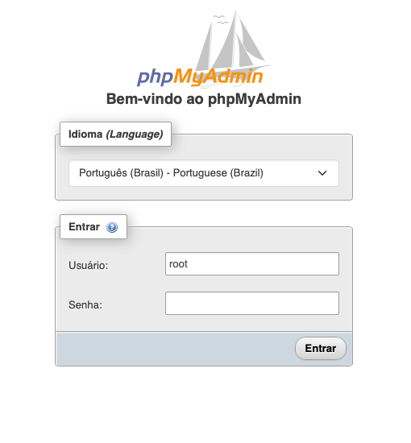

## Docker Databases For Ethical Hacking Penetration Test

## How to Install

### Step 1: Dowload and Install

```sh
# Download the repository
git clone https://github.com/KeystoneDevBr/docker-databases.git

cd docker-databases/

# Start the containers
docker-compose up --build

```

### Step 2: Access the menu index

Open the index page on your browser https://127.0.0.1/index.php


### Stecp 3: Navigating in the options

Obs.: to access the databases, the default password was configured in the **.env** file

### MySQL Admin Page

Navigate to https://127.0.0.1:4443/ to access the PHP My Admin to manage the MySQL Database.

***For test, the root user was configured in blank. User: root ==>  Password: 'in blank'**


---
### MariaDB Admin Page

Navigate to https://127.0.0.1:44443/ to access the PHP My Admin to manage MariaDB Database.
**User: root, Passowd: web**


___

### PostgreSQL Admin Page

Navigate to https://127.0.0.1:5050/ to access the PgAdmin to manage PostgreSQL Database.
**User: admin@local.com, Passowd: web**


___

### SQL Server Admin Page

Navigate to https://127.0.0.1/sqlsrv.php to read more information how to procedure to access the sql server,
or access [.docker/sqlsrv/README.md](./.docker/sqlsrv/README.md)


___

